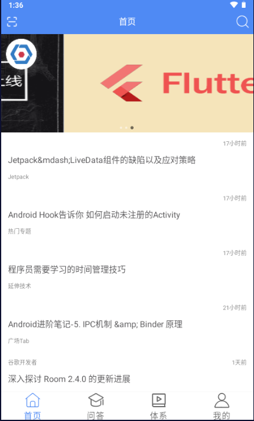
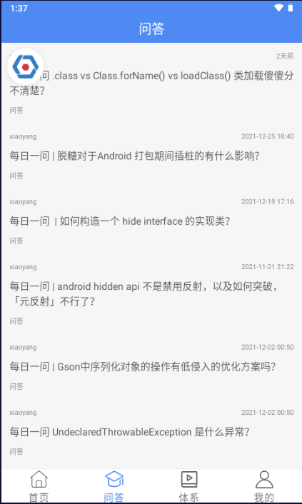
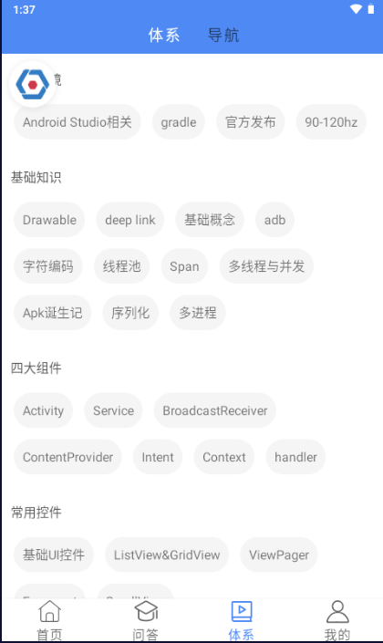
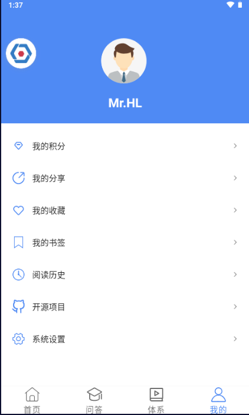
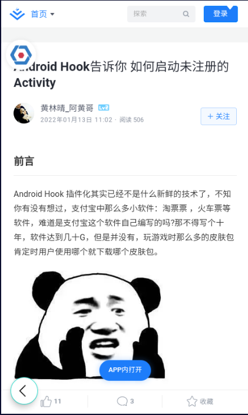
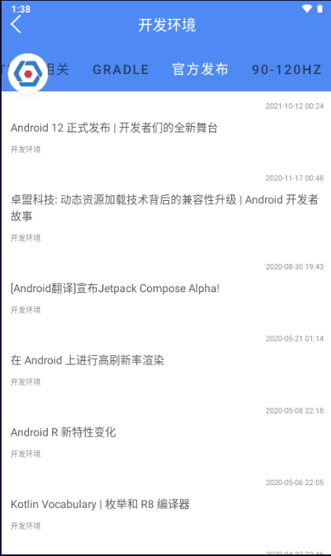

#### 玩安卓APP

##### APP简介

使用  [玩安卓](https://www.wanandroid.com/) 网站开放 API 实现的一款在线学习APP

##### 开发语言

Kotlin+Java

##### 架构设计

MVVM+模块化开发框架

##### 截图展示

|  |  |  |
| -------------- | -------------- | -------------- |
|  |  |  |

##### 主要开源框架

[AndroidAutoSize](https://github.com/JessYanCoding/AndroidAutoSize)

[okhttp](https://github.com/square/okhttp)

[gson](https://github.com/google/gson)

[retrofit](https://github.com/square/retrofit)

[glide](https://github.com/bumptech/glide)

[AgentWeb](https://github.com/Justson/AgentWeb)

[banner](https://github.com/youth5201314/banner)

[SmartRefreshLayout](https://github.com/scwang90/SmartRefreshLayout)

[ARouter](https://github.com/alibaba/ARouter)